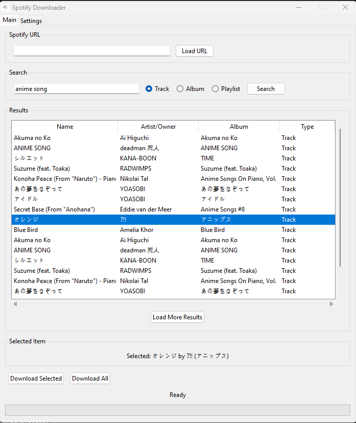

# Spotify Downloader

  
  
  
  
  
  
  *A powerful and user-friendly Spotify music downloader with search capabilities.*

## Features

### Search & Download
- Search tracks, albums, and playlists
- Direct Spotify URL support
- Real-time search results
- Bulk download support
- High-quality audio (320kbps)

### Additional Features
- Multi-language interface
  - English
  - Indonesian
- User-friendly GUI
- Customizable download path
- Progress tracking
- Preview before download

## Quick Start

### Using the Application

1. **Search Music**
   - Enter search query
   - Choose type (track/album/playlist)
   - Click "Search"
   - Select items to download

   

   
View Screenshot

   
   

2. **Direct URL Download**
   - Paste Spotify URL
   - Click "Load URL"
   - Review tracks
   - Start download

   

   
View Screenshot

   
   

3. **Settings Customization**
   - Change language
   - Set download path
   - Quick access to download folder

## Download

Get the latest version:

## Use Cases

- Personal music collection
- Offline listening
- Playlist backup
- Music archiving
- Educational purposes

## Why Choose This Spotify Downloader?

- **Simple**: Clean and intuitive interface
- **Efficient**: Fast search and download
- **Flexible**: Multiple download options
- **Reliable**: High-quality audio output
- **Modern**: Multi-language support

## Support the Project

If you find this tool useful, consider:
- Starring the repository
- Reporting issues
- Suggesting features
- Contributing to the code

## Support Development

  

## License

This project is licensed under the MIT License - see the [LICENSE](LICENSE) file for details.

---

  Made with ❤️ by <a href="https://github.com/enowdev">Enow Antariksa</a>

